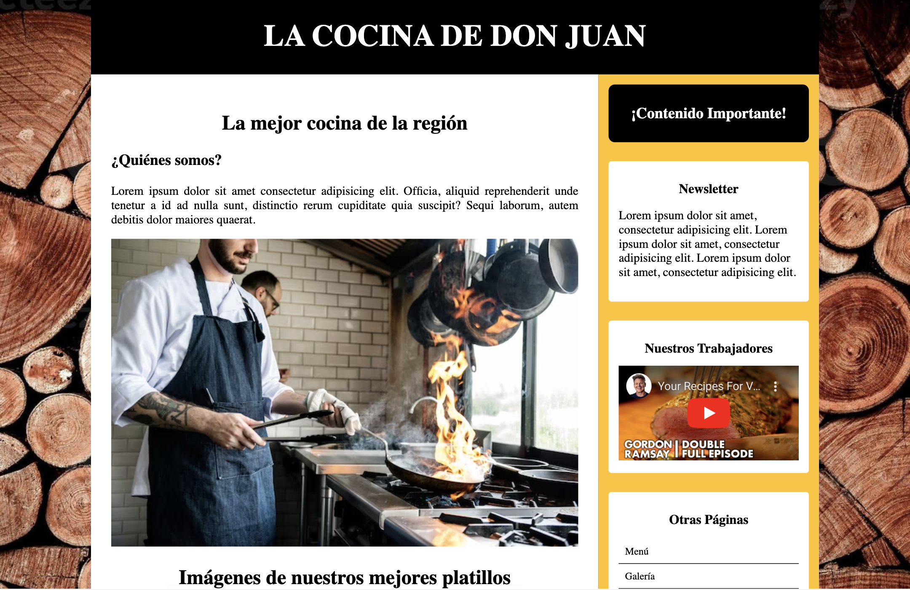

<a name="readme-top"></a>

<!-- PROJECT LOGO -->
<br />
<div align="center">
    <h1 align="center">LA COCINA DE DON JUAN</h1>
</div>

<!-- TABLE OF CONTENTS -->
<details>

  <summary style="font-size: 20px">Tabla de Contenidos</summary>
  <ol>
    <li>
      <a href="#about-the-project">Acerca del proyecto</a>
      <ul>
        <li><a href="#built-with">Tecnologías utilizadas</a></li>
      </ul>
    </li>
    <li>
      <a href="#getting-started">Como correr el proyecto</a>
      <ul>
        <li><a href="#prerequisites">Prerrequisitos</a></li>
        <li><a href="#installation">Instalación</a></li>
      </ul>
    </li>
    <li><a href="#contact">Contacto</a></li>
  </ol>
</details>

<!-- ABOUT THE PROJECT -->

# Acerca del proyecto



## Descripción

El proyecto de GitHub se llama "La Cocinad de Don Juan", y se trata de una página web diseñada para aquellos que quieren experimentar con la cocina, inspirada en un diseño web retro. La página está construida con HTML, CSS, Javascript, Bootstrap y JQuery. A continuación, se detallan los aspectos más importantes del proyecto:

Estructura de la página: La página se divide en varias secciones, como una sección de navegación, una sección de encabezado, una sección de platos principales, una sección de postres, una sección de bebidas y una sección de contacto.

Sección de platos principales: Esta sección presenta varios platos principales que son típicos de la cocina.

Funcionalidad de Bootstrap y JQuery: La página utiliza la funcionalidad de Bootstrap para crear un diseño responsivo y adaptativo, lo que significa que se ajusta automáticamente a diferentes tamaños de pantalla. También se utiliza JQuery para agregar interactividad a la página, como efectos de desplazamiento y animaciones.

En resumen, el proyecto de GitHub "La Cocina de Don Juan" es una página web de cocina que crea una experiencia visualmente atractiva y funcional. La página presenta platos principales, postres y bebidas clásicas de la cocina.

<p align="right">( <a href="#readme-top">Regresar al Inicio</a> )</p>

## Tecnologías utilizadas

<br>

<div>


</div>

<p align="right">( <a href="#readme-top">Regresar al Inicio</a> )</p>

<!-- GETTING STARTED -->

## Corriendo el proyecto

Para crear una copia de este proyecto y correrlo localmente sigue los siguientes pasos:

## Prerrequisitos

Ninguno

### Instalación

1. Clona el repositorio

   ```sh
   git clone git@github.com:juanjosalco/Retro_Web_Design.git
   ```
2. Recomendación para correr el proyecyo:

  -  Descarga la extensión para Visual Studio Code llamada "Live Server".

3. En caso de no contar con la extensión se recomienda abrir el archivo index.html en el navegador

<p align="right">( <a href="#readme-top">Regresar al Inicio</a> )</p>